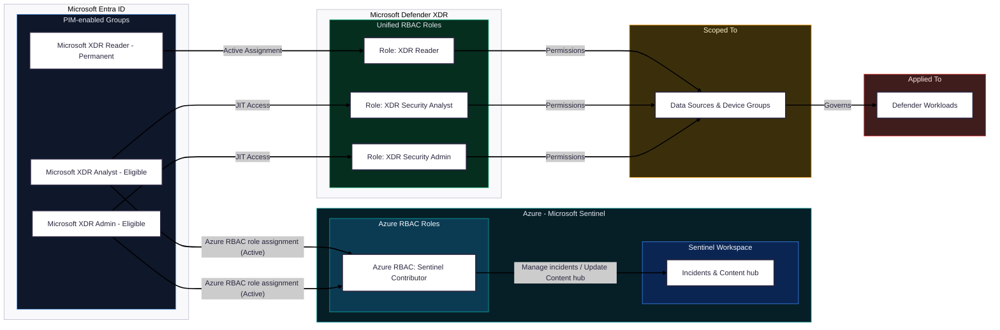

If you run security operations on Microsoft, this is your next quick win. Unified role‑based access control (RBAC) in Microsoft Defender XDR gives analysts one place to work and lets you stop using high privileged Entra ID roles for daily tasks.

## Unified RBAC: Benefits for SecOps 🎯

Unified RBAC gives SecOps one portal with consistent roles and removes day‑to‑day dependency on broad Entra roles. Net effect: simpler workflows and safer least‑privilege operations.

- One place to work across endpoints, identity, email, and apps
- Task‑based permissions with scoped data access (alerts, response, hunting, posture)
- Delegate RBAC inside Defender XDR; keep Entra Global/Security Admin for bootstrap only
- Clear separation of duties and better auditability

Microsoft documents the model, permission groups, and default behavior for new tenants—see References. For role group details, also see “Permissions in Unified RBAC.”

## Unified RBAC is the default ✨

Microsoft states that Unified RBAC is now the default permissions model for new tenants in key Defender workloads:

- New Microsoft Defender for Endpoint tenants from February 16, 2025
- New Microsoft Defender for Identity tenants from March 2, 2025

Existing tenants keep their current configuration until you activate Unified RBAC per workload in the Defender portal.

Reference: “Microsoft Defender XDR Unified RBAC” (link in References).

## Architecture at a glance 🗺️


## Scale and variations 🏗️

This guide shows one minimal, least‑privilege design (Reader / Security Analyst / Security Admin). Larger or regulated organizations often extend it with:

- Tiered Analyst variants: Reader → Analyst‑T1 (alerts, no live response) → Analyst‑T2 (response + basic live response) → Analyst‑T3 (advanced live response; limited detection tuning)
- Admin split: RBAC Admin (Authorization + System/Core security settings) vs. Detection Engineering (Detection tuning), to enforce SoD
- Domain owners: Endpoint Analyst, Email Analyst, Identity Analyst mapped to dedicated scopes/data sources
- Regional/BU scoping: device groups and data sources aligned to business structure to limit blast radius
- Auditor/Compliance: separate read‑only role based on Reader with audit/report access
- PIM everywhere: keep group membership eligible with approvals, MFA, and time‑bound activation

Keep the principles the same: least privilege, scoped access, separation of duties, and periodic access reviews.

## How things work together 🧩



<!-- Mermaid is enabled site-wide via theme partial; fenced ```mermaid blocks will render automatically. -->

How to read the diagram:

- Microsoft Entra ID
  - PIM-enabled groups: Microsoft XDR Reader (permanent), Microsoft XDR Analyst (eligible), Microsoft XDR Admin (eligible)
  - JIT Access connects the Analyst/Admin groups to their Defender XDR roles
- Defender XDR Unified RBAC roles
  - XDR Reader, XDR Security Analyst, XDR Security Admin
  - Roles grant permissions; scopes control which devices/data users can access
- Scoped To and Applied To
  - Scoped To: Data sources and device groups used to enforce least privilege
  - Applied To: Defender workloads where permissions take effect
- Azure – Microsoft Sentinel
  - Azure RBAC Sentinel Contributor is assigned Active to the XDR Analyst and XDR Admin PIM groups
  - This enables managing Sentinel incidents and updating Content hub content

> Why Sentinel Contributor? Analysts need to triage/update incidents and curate content packs. Assign the Azure RBAC role to the PIM groups (Active role assignment, time-bound membership via PIM) to keep least privilege.

## Adopt Unified RBAC in 30 minutes ⏱️

### 1. Activate Unified RBAC per workload

- In the Defender portal, go to Settings → Permissions and roles → Microsoft Defender XDR
- Follow the activation flow per workload (endpoints, identity, Office 365, etc.)


### 2. Remove standing broad roles from day‑to‑day

- Keep Global/Security Admin for emergencies only
- Create a small “Authorization managers” role using Unified RBAC with Authorization (Manage) and Core security settings (Read)
- Assign to a restricted admin group for role lifecycle only

### 3. Grouping and PIM (recommended)

- Create Entra groups, for example: Microsoft-XDR-Reader, Microsoft-XDR-Analyst, Microsoft-XDR-Admin
- Make these groups role‑assignable (Assignable to directory roles). This restricts membership/changes to Global Administrator or Privileged Role Administrator; regular group owners can’t modify role‑assignable groups.
- Note: Role‑assignable groups can’t be dynamic and can’t be nested—use static, non‑nested security groups.
- Enable Microsoft Entra PIM for just-in-time activation
- Assign Unified RBAC roles to these groups with scoped data sources/device groups

### 4. Create roles using your model

- XDR Reader: Read-only across incidents/alerts/devices and posture. Grant Security data basics (Read), Vulnerability management (Read), Core security settings (Read), System settings (Read); add Email & collaboration metadata (Read) if needed.
- XDR Security Analyst: Full investigation and response. Add Alerts (Manage), Response (Manage), Basic/Advanced live response (Manage), File collection (Manage), Email quarantine (Manage), Email advanced actions (Manage), plus posture exceptions/remediation (Manage).
- XDR Security Admin: Administer RBAC and configuration. Add Authorization (Read/Manage), Core security settings (Manage), Detection tuning (Manage), System settings (Read/Manage). Includes Analyst capabilities.
- Scope each role to the right device groups/data sources; avoid “All data” unless required.


### 5. Pilot, then roll out

- Assign pilot users/groups to the PIM-enabled groups and validate tasks
- Remove overlapping Entra Security Administrator usage in daily operations

PIM blade for activating roles:


## Role recipes 🍱

| Role | Intended use | Key permission groups (XDR) | Typical scopes | Entra group & PIM | Azure dependency |
|---|---|---|---|---|---|
| XDR Reader | Read-only visibility for auditors/leads | Security data basics (Read); Vulnerability management (Read); Core security settings (Read); System settings (Read); Email & collaboration metadata (Read, optional) | Org-wide read or BU/region device groups | Microsoft‑XDR‑Reader (permanent) | None |
| XDR Security Analyst | SOC triage, investigation, and response | Alerts (Manage); Response (Manage); Basic Live response (Manage); Advanced Live response (optional); File collection (Manage); Email quarantine (Manage); Email advanced actions (optional) | Device groups for the SOC area; relevant email/user data sources | Microsoft‑XDR‑Analyst (eligible via PIM) | Azure RBAC: Sentinel Contributor (Active) |
| XDR Security Admin | Configure XDR, RBAC, and detections; includes Analyst | Authorization (Read/Manage); Detection tuning (Manage); Core security settings (Manage); System settings (Read/Manage); Analyst capabilities | Org-wide for config; keep “Authorization managers” small | Microsoft‑XDR‑Admin (eligible via PIM) | Azure RBAC: Sentinel Contributor (Active) |

## ⚠️ Practical tips and pitfalls

- If you want a clean XDR portal, remove roles defined prior to Unified RBAC
- Use device groups and tags to scope access for multi‑team or regional models
- Keep one small group with Authorization (Manage); treat it like break‑glass for RBAC admin

## References (Microsoft Docs) 📚

- Unified RBAC overview, activation, and defaults for new tenants: [learn.microsoft.com/defender-xdr/manage-rbac](https://learn.microsoft.com/en-us/defender-xdr/manage-rbac)
- Permission groups and details (build your custom roles): [learn.microsoft.com/defender-xdr/custom-permissions-details](https://learn.microsoft.com/en-us/defender-xdr/custom-permissions-details)
- Map existing product roles to Unified RBAC: [learn.microsoft.com/defender-xdr/compare-rbac-roles](https://learn.microsoft.com/en-us/defender-xdr/compare-rbac-roles)

---

Notes

- Prereqs: You need Entra Global or Security Administrator to initially access “Permissions and roles” and to bootstrap Unified RBAC; after that, delegate Authorization within Defender XDR to remove broad Entra roles from daily operations.
- Compliance and Purview‑managed permissions are still handled in Microsoft Purview.
